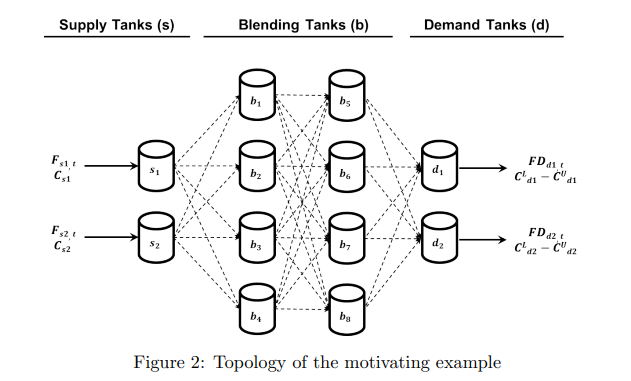

# BlendingRL
Deep Learning and RL Approach to the multiperiod Blending problem

## Example environment

*Source: [An MILP-MINLP decomposition method for the global optimization of a source based model of the multiperiod blending problem](https://optimization-online.org/wp-content/uploads/2015/04/4864.pdf)*

Our environment is comprised of source tanks that generate product according to supply values at each timestep, blending tanks that take product from source and/or other blending tanks, and demand tanks that take product from blending tanks and sell the product depending on the concentrations and the demand values at the given timestep.

A critical constraint is that no blending tank can have both incoming and outgoing flow at the same timestep. The environment are coded to prevent and penalize illegal actions that disrespect this rule, as well as other "common sense rules" (no action that would result in negative inventories after each timestep, etc.)

We use pytorch, stable_baselines3 and Tensorboard for visualization.

Please check out the PDF file for the MDP definition, `envs.py` for the environment definition, `models.py` for custom policy and model definitions, and the `RL_train_simplest.ipynb` notebook for the training process.
